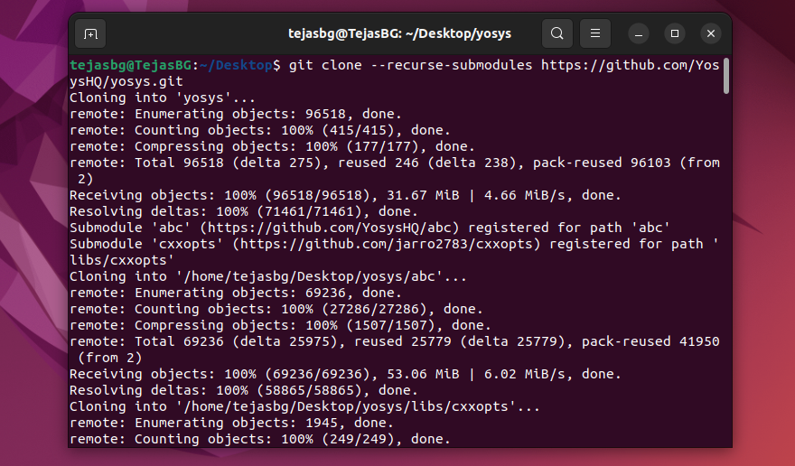
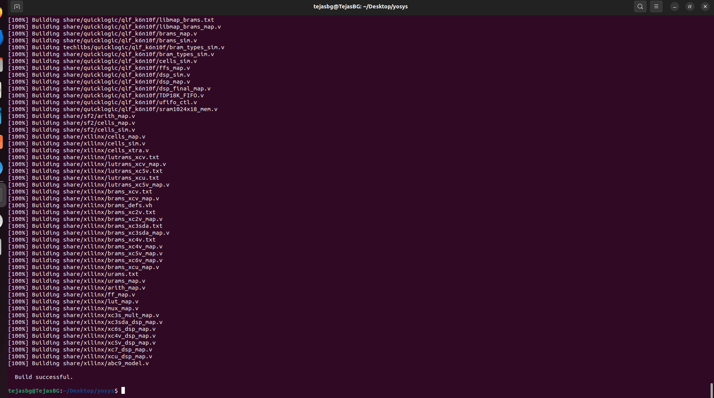
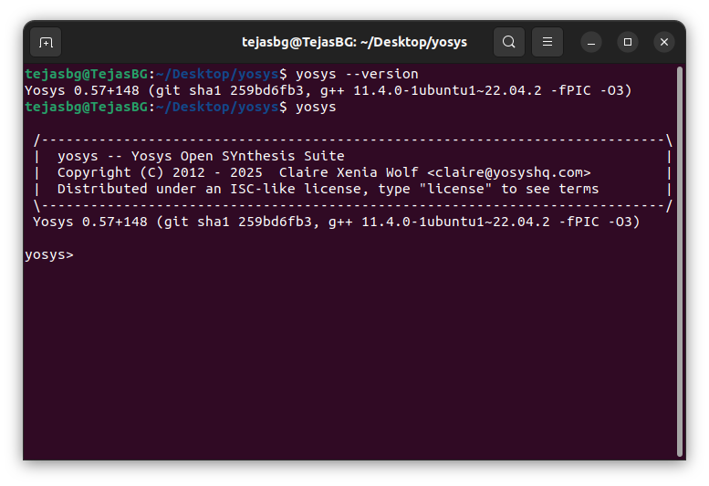
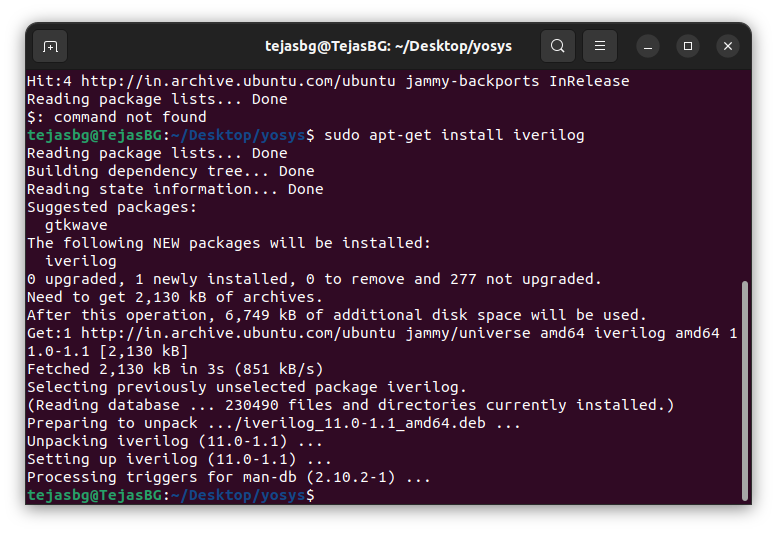
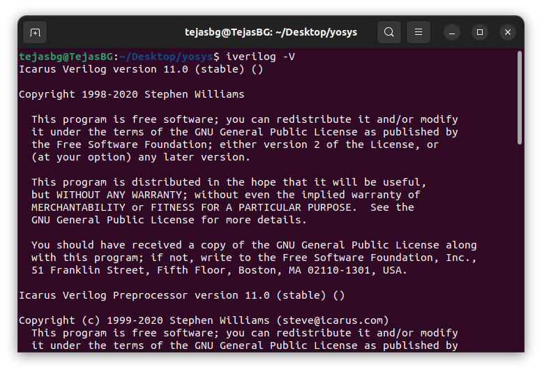
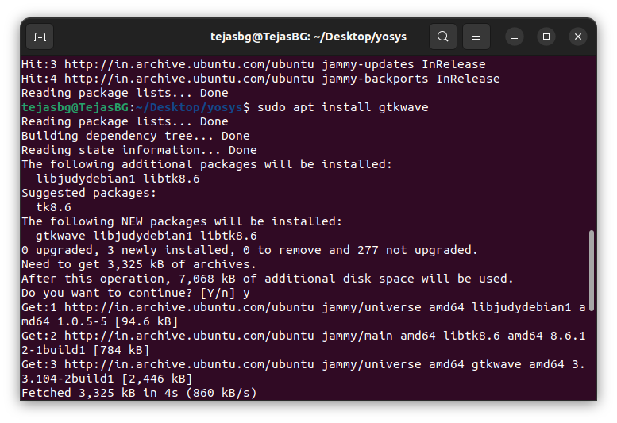
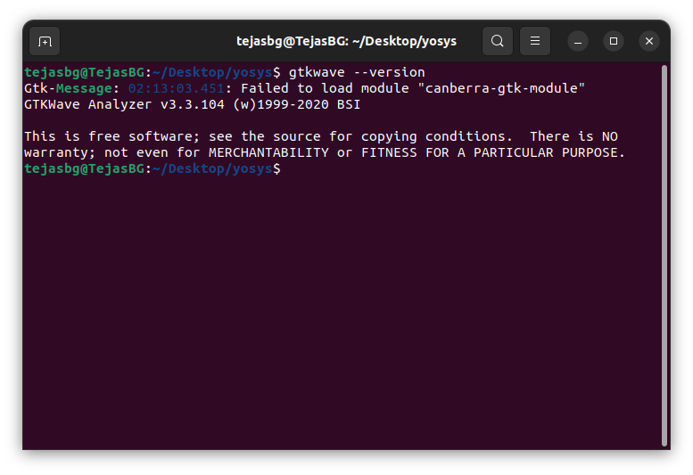

# Week 0 : Installation of Yosys, Icarus Verilog & GTKWave

## System Specifications
- Minimum 6 GB RAM
- Minimum 50 GB HDD space
- Ubuntu Operating System above the version 20 (virtual machine in Oracle VirtualBox or Windows WSL recommended)

---

## Tools Overview

###  Yosys
<!--  -->
Yosys is an open-source RTL synthesis tool that converts Verilog designs into gate-level netlists. It is widely used for digital logic synthesis and preparing designs for physical implementation.

#### Installation
To install Yosys on Ubuntu git & make should be installed else just run `sudo apt install git` & `sudo apt-get install make`, then run:
```
$ sudo apt-get update
$ git clone --recurse-submodules https://github.com/YosysHQ/yosys.git
$ cd yosys
sudo apt-get install build-essential clang bison flex \
libreadline-dev gawk tcl-dev libffi-dev git \
graphviz xdot pkg-config python3 libboost-system-dev \
libboost-python-dev libboost-filesystem-dev zlib1g-dev
$ make config-gcc
$ make
$ sudo make install

```
<!--


 -->

<div align="center">
  
</div>

<div align="center">
  
</div>


#### Verification
You can verify installation with:

```
$ yosys --version
```
<!--  -->
<div align="center">
  
</div>


---

###  Icarus Verilog
<!-- 
-->Icarus Verilog is a Verilog simulation and synthesis toolchain used for compiling and simulating Verilog HDL designs, essential for RTL simulation in digital design.

#### Installation
To install Icarus Verilog, use:
```
$ sudo apt-get update
$ sudo apt-get install iverilog

```

<div align="center">
  
</div>

#### Verification
Verify installation by checking the version:
```
$ iverilog -v
```

<div align="center">
  
</div>


---

###   GTKWave    

<!--- --> 
GTKWave is a waveform viewer for digital simulation output. It allows you to visualize signals and debug your simulation results with ease.

#### Installation
To install GTKWave, run:

```
$ sudo apt-get update
$ sudo apt install gtkwave

```
<div align="center">
  
</div>


#### Verification
Verify installation by running:
```
$ gtkwave --version
```

<div align="center">
  
</div>


