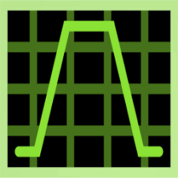

# Week 0 : Installation of Yosys, Icarus Verilog & GTKWave

## System Specifications
- Minimum 6 GB RAM
- Minimum 50 GB HDD space
- Ubuntu Operating System (virtual machine in Oracle VirtualBox or Windows WSL recommended)

---

## Tools Overview

### Yosys

Yosys is an open-source RTL synthesis tool that converts Verilog designs into gate-level netlists. It is widely used for digital logic synthesis and preparing designs for physical implementation.

#### Installation
To install Yosys on Ubuntu, run:
```
csdcds

```

You can verify installation with:

```

```

---

### Icarus Verilog

Icarus Verilog is a Verilog simulation and synthesis toolchain used for compiling and simulating Verilog HDL designs, essential for RTL simulation in digital design.

#### Installation
To install Icarus Verilog, use:
```
```

Verify installation by checking the version:
```
```

---

### GTKWave

GTKWave is a waveform viewer for digital simulation output. It allows you to visualize signals and debug your simulation results with ease.

#### Installation
To install GTKWave, run:

```
```

Verify installation by running:
```
```


